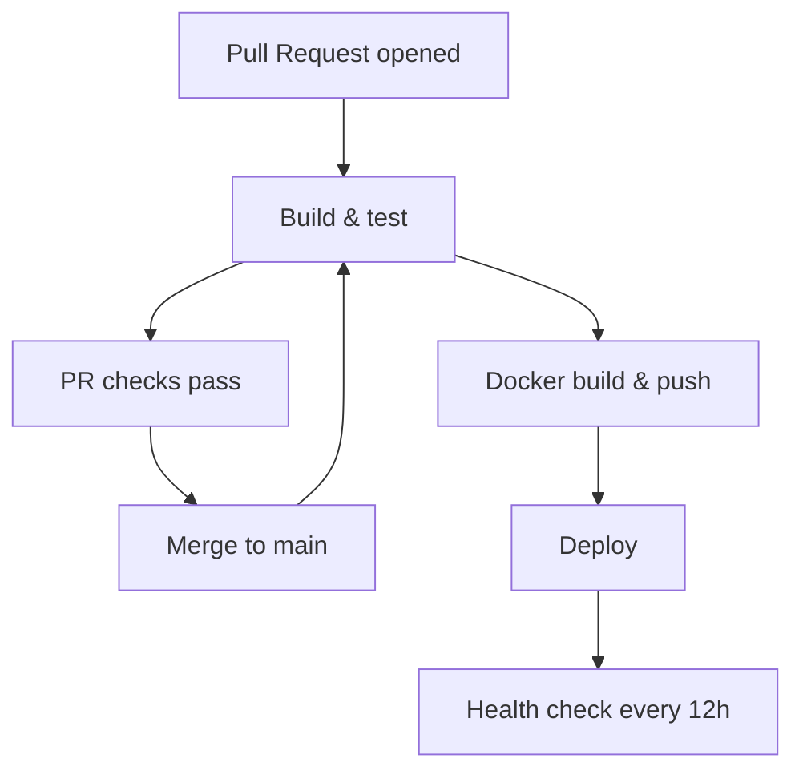

# Day 09 – Building a Simple DevOps API with FastAPI (Capstone Project 1)

## Workflow status

## About this project

This repository builds a FastAPI-based DevOps service with GitHub Actions CI/CD. It combines API routing, health monitoring, AWS usage reporting, and metrics analysis into a practical Python service.

### FastAPI overview

- App entry point: `main.py`
- API router: `app/api.py`
- Route modules: `routes/aws_usage.py`, `routes/metrics.py`
- Service logic: `services/aws_usage.py`, `services/metric_service.py`
- Run locally with:
  `uvicorn main:app --reload`
- Common endpoints:
  - `/health` → service health status
  - `/metrics` → metrics summary
  - `/aws` → AWS usage summary

## Pipeline architecture

Modern CI/CD flow with PR validation, main branch deployment, and recurring health checks.

### Workflow flow

- PR opened → build & test → PR checks pass
- Merge to `main` → build & test → Docker build & push → deploy
- Every 12 hours → health check

### Architecture diagram

### Notes

- `pr-pipeline.yml` validates pull requests with build and test jobs.
- `main-pipeline.yml` runs on merges to `main` and continues with Docker build/push and deployment.
- `health-check.yml` runs every 12 hours to verify service availability.
- `reusable-build-test.yml` and `reusable-docker.yml` share common workflow logic for faster maintenance.
